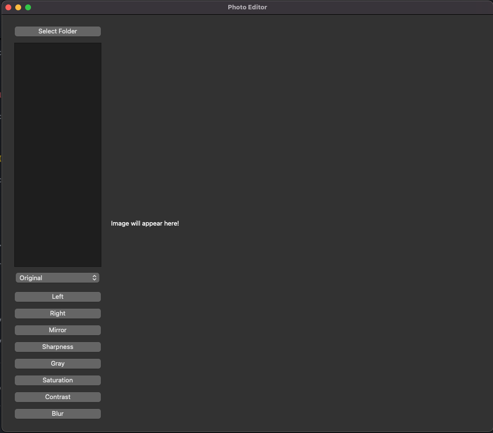

# Photo Editor

A simple photo editing application built with PyQt5 and PIL (Pillow) that allows users to perform various image manipulations. This application provides a user-friendly interface for editing images, including options for rotating, mirroring, sharpening, blurring, and adjusting color and contrast.

## Features

- **Image Loading**: Select a folder and load images in supported formats (SVG, JPG, JPEG, PNG).
- **Image Manipulations**:
  - Rotate left or right
  - Mirror image
  - Convert to grayscale
  - Adjust sharpness
  - Apply blur effect
  - Enhance color saturation
  - Adjust contrast
- **Preview**: View the edited image in real-time.
  

## Requirements

- Python 3.x
- PyQt5
- Pillow

## Installation

1. Clone the repository:
   ```bash
   git clone https://github.com/rimansingh/photo-editor.git
   ```
2. Navigate to the project directory:
   ```bash
   cd photo-editor
   ```
3. Install the required packages:
   ```bash
   pip install PyQt5 Pillow
   ```

## Usage

1. Run the application:
   ```bash
   python main.py
   ```
2. Click on "Select Folder" to choose the directory containing your images.
3. Select an image from the list to load it.
4. Use the buttons to apply various effects to the image.
5. The edited image will be saved in the `edits/` folder within the selected directory.
